# Niche — System Architecture

A peer-to-peer Mac Mini marketplace with on-chain USDC escrow on Base. Buyers and sellers coordinate in-person meetups with funds held in escrow until both parties confirm the trade.

---

## 1. System Overview

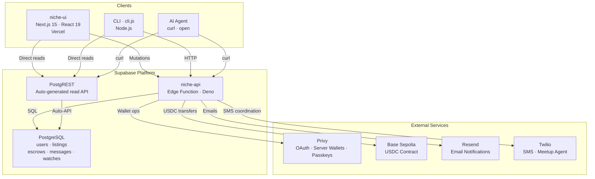

| Component | Technology | Responsibility | Deployed To |
|-----------|-----------|----------------|-------------|
| **niche-ui** | Next.js 15, React 19, Tailwind 4 | Web UI for humans | Vercel |
| **CLI** | Node.js 18+ | Terminal client for agents + power users | npm (local) |
| **niche-api** | Deno (Supabase Edge Function) | All backend logic: auth, escrow, wallets, messages | Supabase |
| **PostgreSQL** | Supabase Postgres | Persistent storage | Supabase |
| **PostgREST** | Auto-generated from schema | Read-only API for listings, escrows | Supabase |
| **Privy** | SaaS | Twitter OAuth, server-side wallets, passkey verification | privy.io |
| **Base Sepolia** | EVM L2 testnet | USDC escrow transfers | Base network |
| **Resend** | SaaS | Email notifications on escrow completion | resend.com |
| **Twilio** | SaaS (proposed) | SMS-based meetup coordination agent | twilio.com |

---

## 2. User Flow → Technology Flow

Each subsection maps a user action to the exact technical sequence that executes it.

### 2a. Authentication (Twitter Login)

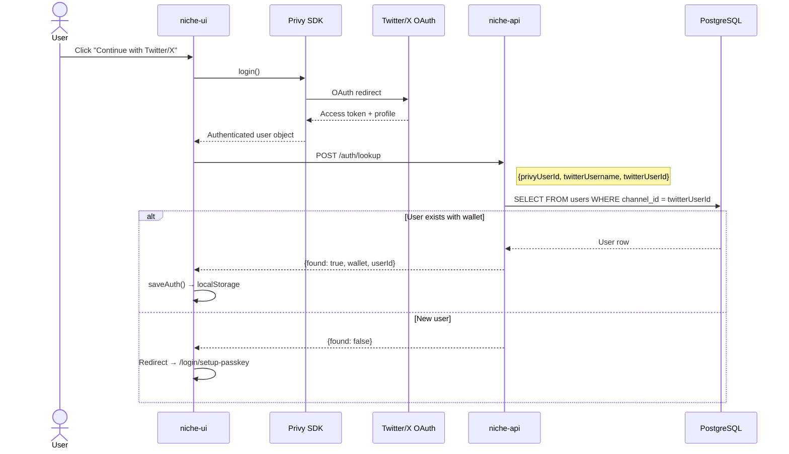

### 2b. Passkey Setup + Wallet Creation

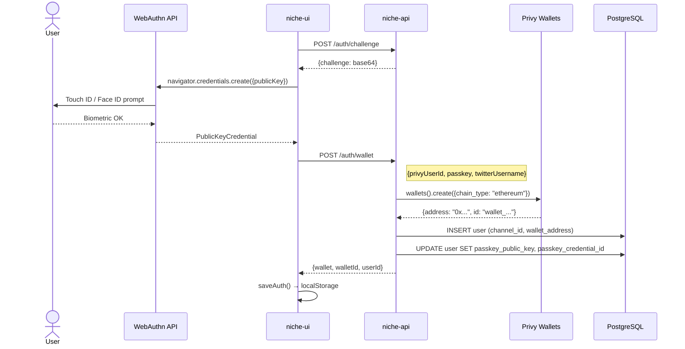

### 2c. Deposit (Buyer Claims a Listing)

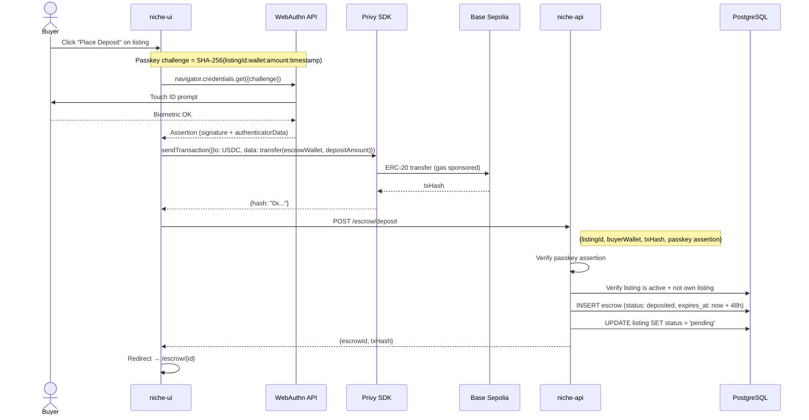

### 2d. Escrow Lifecycle (Accept → Release)

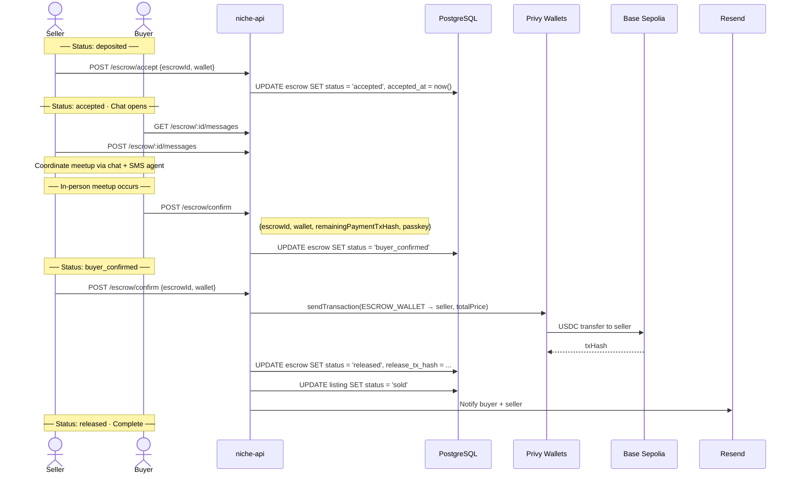

### 2e. Browse & Search

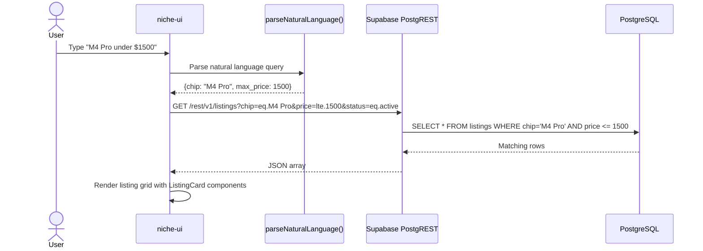

---

## 3. Data Flow

### 3a. Deposit Data Flow

Shows how data moves through each layer when a buyer places a deposit.

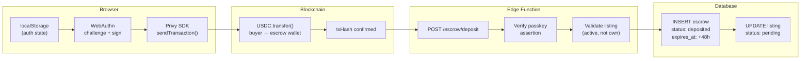

### 3b. Fund Release Data Flow

Shows how data moves when a seller confirms the handoff and funds are released.

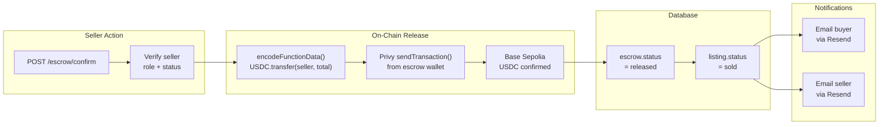

---

## 4. Escrow State Machine

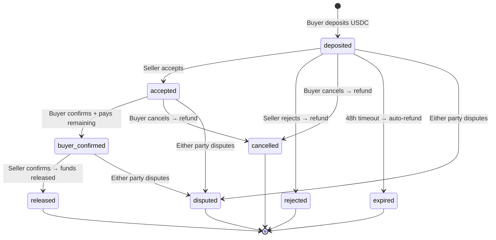

| State | Who Acts Next | What Happens | On-Chain Effect |
|-------|--------------|--------------|-----------------|
| **deposited** | Seller (48h window) | Accept, reject, or let expire | Deposit USDC held in escrow wallet |
| **accepted** | Buyer | Chat opens, arrange meetup | No change |
| **buyer_confirmed** | Seller | Buyer inspected item + paid remaining | Remaining USDC in escrow wallet |
| **released** | — | Transaction complete | Total USDC transferred to seller |
| **rejected** | — | Listing reactivated | Deposit refunded to buyer |
| **cancelled** | — | Listing reactivated | Deposit refunded to buyer |
| **expired** | — | Auto after 48h, listing reactivated | Deposit refunded to buyer |
| **disputed** | Admin | Manual resolution required | Funds frozen in escrow wallet |

---

## 5. Secure Meetup Coordination

> **Status: Proposed Design**
>
> This section describes a planned feature that is not yet implemented. The goal is to make meetup coordination simple, private, and safe.

### The Problem

After escrow reaches `accepted`, buyer and seller need to arrange an in-person meetup. Today this happens via freeform chat — which means:

- **Privacy risk**: Phone numbers and addresses end up in the app database
- **Friction**: Back-and-forth messaging to find a time and place
- **No safety guardrails**: No suggestion of public venues, no safety tips

### The Solution: Agent-Mediated SMS Coordination

An AI agent handles the logistics via SMS. No location data or phone numbers are ever stored in the app database.

```
┌──────────────────────────────────────────────────────────┐
│                    DESIGN PRINCIPLES                      │
│                                                          │
│  1. No location data in the app database — ever          │
│  2. Phone numbers only exist in Twilio (72h auto-delete) │
│  3. Agent suggests only safe public venues               │
│  4. Both parties must confirm before meetup is set        │
│  5. Either party can cancel/reschedule via SMS            │
└──────────────────────────────────────────────────────────┘
```

### Trigger

The meetup agent activates when escrow status transitions to **`accepted`**. At this point the seller has committed and both parties need to coordinate.

### Phone Number Collection

When escrow transitions to `accepted`, the escrow UI shows a **one-time phone input field**:

> "Ready to coordinate your meetup? Enter your phone number below. Our meetup agent will handle scheduling via SMS. Your number is only shared with the coordination agent — never stored in the app."

The phone number is:
1. Submitted directly from the UI to the meetup agent service (Twilio)
2. **Never written to the messages table or any app database table**
3. Stored only in Twilio's context with a 72-hour auto-deletion policy

### Agent Coordination Flow

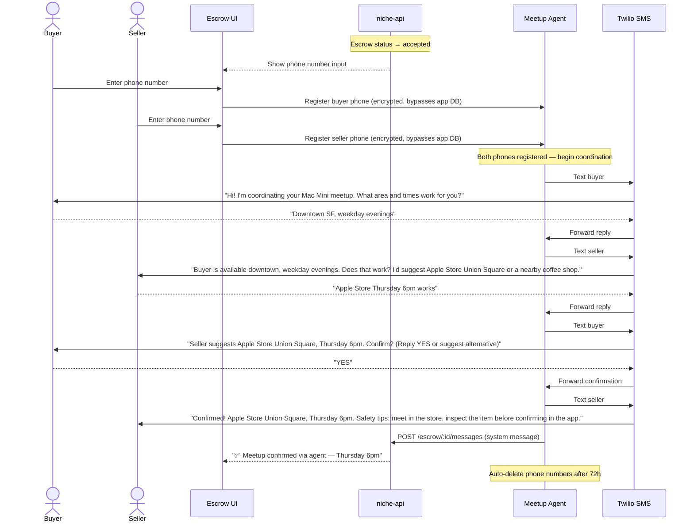

### Privacy Boundary

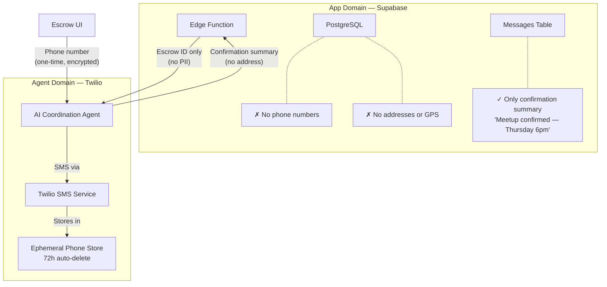

### What Lives Where

| Data | App Database | Twilio/Agent | Blockchain |
|------|-------------|-------------|------------|
| Phone numbers | ✗ Never | ✓ 72h then deleted | ✗ Never |
| Meeting location | ✗ Never | ✓ In SMS thread only | ✗ Never |
| Meeting time | ✗ Never | ✓ In SMS thread only | ✗ Never |
| Confirmation status | ✓ System message in chat | ✓ In agent context | ✗ N/A |
| Wallet addresses | ✓ Users table | ✗ N/A | ✓ On-chain |
| USDC amounts | ✓ Escrows table | ✗ N/A | ✓ On-chain |

### Agent Safety Features

1. **Public venues only** — Agent suggests Apple Stores, coffee shops, public libraries, police station lobbies
2. **Unsafe location warning** — If either party suggests a residential address or isolated area, the agent flags it and suggests alternatives
3. **Safety tips SMS** — Both parties receive a safety checklist before the meetup:
   - Meet in a well-lit public place
   - Inspect the item before confirming in the app
   - Bring a friend if possible
   - Don't share your wallet seed phrase
4. **Reschedule/cancel** — Either party can text the agent to reschedule or cancel at any time
5. **Auto-expiry** — Agent conversation expires 72 hours after confirmation. If neither party shares a phone number within 24 hours of `accepted`, the system falls back to in-app chat only

---

## 6. Security Model

### Authentication Layers

| Layer | Technology | Purpose |
|-------|-----------|---------|
| **Identity** | Privy + Twitter OAuth | Social login, user identification |
| **Authorization** | WebAuthn passkeys | Transaction signing via Touch ID / Face ID |
| **Wallet** | Privy server-side wallets | One-per-user, non-custodial |
| **API access** | Supabase anon key | Public read access to listings |
| **Backend access** | Supabase service role key | Full DB access in Edge Function |

### Passkey Challenge-Response

All financial transactions (deposit, remaining payment) require a passkey assertion:

1. **Client** generates challenge: `SHA-256(listingId + ":" + wallet + ":" + amount + ":" + timestamp)`
2. **WebAuthn** signs the challenge with the device's biometric sensor (Touch ID / Face ID)
3. **Server** verifies:
   - `authenticatorData` structure is valid
   - `clientDataJSON.type === "webauthn.get"`
   - `credentialId` matches the user's registered passkey
   - Challenge parameters match the transaction parameters

### Access Control Matrix

| Action | Anonymous | Authenticated Buyer | Authenticated Seller | Either Party |
|--------|-----------|-------------------|---------------------|-------------|
| Browse listings | ✓ | ✓ | ✓ | — |
| View listing detail | ✓ | ✓ | ✓ | — |
| Place deposit | — | ✓ (passkey required) | — | — |
| Accept deposit | — | — | ✓ | — |
| Reject deposit | — | — | ✓ | — |
| Send message | — | ✓ | ✓ | — |
| Read messages | — | ✓ | ✓ | — |
| Confirm + pay remaining | — | ✓ (passkey required) | — | — |
| Confirm handoff (release) | — | — | ✓ | — |
| Cancel escrow | — | ✓ | — | — |
| File dispute | — | — | — | ✓ |

### On-Chain Security

- **Escrow wallet**: App-owned Privy server wallet — only the Edge Function can sign transactions from it
- **USDC contract**: `0x036CbD53842c5426634e7929541eC2318f3dCF7e` on Base Sepolia
- **Chain ID**: 84532
- **Gas sponsorship**: Privy sponsors gas fees — users never need ETH
- **Precision**: USDC uses 6 decimal places (amounts multiplied by 10^6)
- **Idempotency**: Wallet creation uses idempotency keys to prevent duplicates

---

## 7. Deployment Architecture

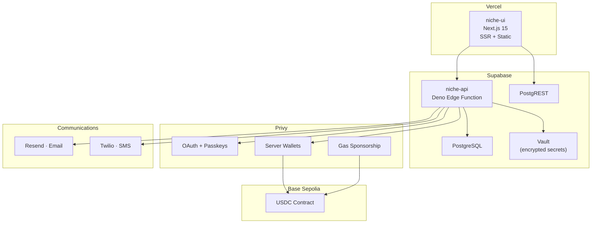

### Environment Variables

| Variable | Where | Purpose |
|----------|-------|---------|
| `NEXT_PUBLIC_PRIVY_APP_ID` | Vercel | Privy app identifier (client-side) |
| `NEXT_PUBLIC_SUPABASE_URL` | Vercel | Supabase project URL (client-side) |
| `NEXT_PUBLIC_SUPABASE_ANON_KEY` | Vercel | Supabase anonymous key (client-side) |
| `PRIVY_APP_ID` | Supabase Vault | Privy app identifier (server-side) |
| `PRIVY_APP_SECRET` | Supabase Vault | Privy authentication secret |
| `ESCROW_WALLET_ID` | Supabase Vault | Privy wallet ID for the treasury |
| `ESCROW_WALLET_ADDRESS` | Supabase Vault | Ethereum address of escrow wallet |
| `RESEND_API_KEY` | Supabase Vault | Email notification service key |

### Client Comparison

| Capability | Web UI | CLI | AI Agent |
|-----------|--------|-----|----------|
| Browse listings | ✓ Grid view | ✓ `niche search` | ✓ curl PostgREST |
| Login | ✓ Twitter OAuth in-app | ✓ Opens browser | ✓ Opens browser |
| Deposit | ✓ Passkey in-app | ✓ Opens browser | ✓ Opens browser |
| Chat | ✓ In-app messaging | — | — |
| Confirm/Cancel | ✓ In-app | ✓ `niche confirm` | ✓ curl Edge Function |
| Watch alerts | — | ✓ `niche watch` | ✓ cron-compatible |

---

## 8. Database Schema

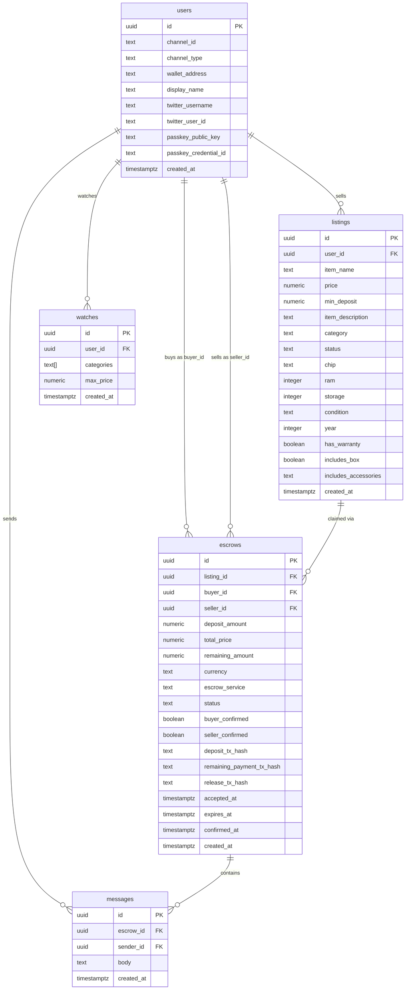

### Indexes

| Index | Table | Columns | Purpose |
|-------|-------|---------|---------|
| `idx_listings_chip` | listings | chip | Filter by Apple Silicon chip |
| `idx_listings_ram` | listings | ram | Filter by RAM |
| `idx_listings_condition` | listings | condition | Filter by condition |
| `idx_messages_escrow` | messages | escrow_id, created_at | Fast message retrieval per escrow |
| `idx_escrows_remaining_tx` | escrows | remaining_payment_tx_hash | Transaction lookup |
